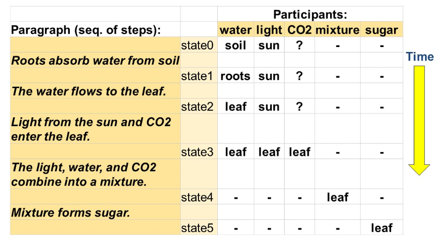

# KOALA
Pytorch implementation of **K**n**O**wledge-**A**ware procedura**L** text underst**A**nding model on ProPara dataset (WWW 2021 long paper). The KOALA model achieves state-of-the-art results on ProPara dataset on September 2020 ([leaderboard](https://leaderboard.allenai.org/propara/submissions/public)).

## Data

KOALA uses the [ProPara dataset](http://data.allenai.org/propara/) collected by AI2. This dataset is about a reading comprehension task on procedural text, *i.e.*, a text paragraph that describes a natural process (*e.g.*, photosynthesis, evaporation, etc.). AI models are required to read the paragraph, then predict the state changes (CREATE, MOVE, DESTROY or NONE) as well as the locations of the given entities.



AI2 released the dataset [here](https://docs.google.com/spreadsheets/d/1x5Ct8EmQs2hVKOYX7b2nS0AOoQi4iM7H9d9isXRDwgM/edit#gid=832930347) in the form of Google Spreadsheet. We need three files to run the KOALA model, *i.e.*, the Paragraphs file for the raw text, the Train/Dev/Test file for the dataset split, and the State_change_annotations file for the annotated entities and their locations. I also provide a copy in `data/` directory which is identical to the official release.

## Setup

1. Create a virtual environment with python >= 3.7.

2. Install the dependency packages in `requirements.txt`:

   ```bash
   pip install -r requirements.txt
   ```

3. If you want to create your own dataset using `preprocess.py`, you also need to download the en_core_web_sm model for English language support of SpaCy:

   ```bash
   python -m spacy download en_core_web_sm
   ```

## Usage

1. [Download](https://docs.google.com/spreadsheets/d/1x5Ct8EmQs2hVKOYX7b2nS0AOoQi4iM7H9d9isXRDwgM/edit#gid=832930347) the dataset or use my copy in `data/`.

2. Process the CSV data files:

   ```bash
   python preprocess.py
   ```

   By default, the files should be put in `data/` and the output JSON files are also stored in `data/`. You can specify the input and output paths using optional command-line arguments. Please refer to the code for more details of command-line arguments.
   
   **P.S.** Please download the files in CSV format if you want to process the raw data using `preprocess.py`.
   
   **P.P.S.** If you choose to pre-process your own data, your dataset will get different orders of location candidates (compared to my copy in `data/`) due to the randomness of python set. This will lead to slightly different model performance due to the existence of dropout.

   Time for running the pre-process script may vary according to your CPU performance. It takes me about 50 minutes on a Intel Xeon 3.7GHz CPU.

3. Train a KOALA model:

   ```bash
   python train.py -mode train -ckpt_dir ckpt -train_set data/train.json -dev_set data/dev.json\
   -cpnet_path CPNET_PATH -cpnet_plm_path CPNET_PLM_PATH -cpnet_struc_input -state_verb STATE_VERB_PATH\
   -wiki_plm_path WIKI_PLM_PATH -finetune
   ```

   where `-ckpt_dir` denotes the directory where checkpoints will be stored.

   `CPNET_PATH` should point to the retrieved ConceptNet knowledge triples.  `STATE_VERB_PATH` should point to the co-appearance verb set of entity states. My copy of these two files are stored in `ConceptNet/result/`. Please refer to `ConceptNet/` for more details of generating these files from scratch.

   `CPNET_PLM_PATH` should point to the BERT model pre-fine-tuned on ConCeptNet triples. `WIKI_PLM_PATH` should point to the BERT model pre-fine-tuned on Wiki paragraphs. My copy of pre-fine-tuned encoders are stored in [Google Drive](https://drive.google.com/drive/folders/1i0rFPx5DKUXXgoaqlyYsEHLqPonz1yWF?usp=sharing). Please refer to `wiki/` and `finetune/` for more details of collecting Wiki paragraphs and fine-tuning BERT encoders.

   Some useful training arguments:

   ```
   -save_mode     Checkpoint saving mode. 'best' (default): only save the best checkpoint on dev set. 
                  'all': save all checkpoints. 
                  'none': don't save checkpoints.
                  'last': save the last checkpoint.
                  'best-last': save the best and the last checkpoints.
   -epoch         Number of epochs to run the dataset. You can set it to -1 
                  to remove epoch limit and only use early stopping 
                  to stop training.
   -impatience    Early stopping rounds. If the accuracy on dev set does not increase for -impatience rounds, 
                  then stop the training process. You can set it to -1 to disable early stopping 
                  and train for a definite number of epochs.
   -report        The frequency of evaluating on dev set and save checkpoints (per epoch).
   ```

   Time for training a new model may vary according to your GPU performance as well as your training schema (*i.e.*, training epochs and early stopping rounds). It takes me about 1 hour to train a new model on a single Tesla P40.

4. Predict on test set using a trained model:

   ```bash
   python -u train.py -mode test -test_set data/test.json -dummy_test data/dummy-predictions.tsv\
   -output predict/prediction.tsv -cpnet_path CPNET_PATH -cpnet_plm_path CPNET_PLM_PATH\
   -cpnet_struc_input -state_verb STATE_VERB_PATH -wiki_plm_path WIKI_PLM_PATH -restore ckpt/best_checkpoint.pt
   ```

   where -output is a TSV file that will contain the prediction results, and -dummy_test is the output template to simplify output formatting. The `dummy-predictions.tsv` file is provided by the [official evaluation script](https://github.com/allenai/aristo-leaderboard/tree/master/propara/data/test) of AI2, and I just copied it to `data/`.

5. Run the evaluation script using the ground-truth labels and your predictions:

   ```bash
   python evaluator/evaluator.py -p data/prediction.tsv -a data/answers.tsv --diagnostics data/diagnostic.txt
   ```

   where `answers.tsv` contains the ground-truth labels, and `diagnostic.txt` will contain detailed scores for each instance. `answers.tsv` can be found [here](https://github.com/allenai/aristo-leaderboard/tree/master/propara/data/test), or you can use my copy in `data/`. `evaluator` directory contains the [evaluation scripts](https://github.com/allenai/aristo-leaderboard/tree/master/propara/evaluator) provided by AI2.
   

## Reproducibility

We have uploaded the trained model & the output predictions to [Google Drive](https://drive.google.com/drive/folders/1d2lXtF64c-wpCQxrHUyjylnBxI6NK-JO?usp=sharing). Uploading this trained model during test time can reproduce the 70.4 F1 score as shown on the leaderboard.

For more issues regarding training your own model to reproduce the results, please refer to [our post](https://github.com/ytyz1307zzh/KOALA/issues/2) in Issues.

   
## Reference
Please kindly cite our paper if you find our work useful.
   ```
   @inproceedings{zhang2021koala,
     author    = {Zhihan Zhang and
                  Xiubo Geng and
                  Tao Qin and
                  Yunfang Wu and
                  Daxin Jiang},
     title     = {Knowledge-Aware Procedural Text Understanding with Multi-Stage Training},
     booktitle = {{WWW} '21: The Web Conference 2021, Ljubljana, Slovenia, April 19--23, 2021},
     year      = {2021}
   }
   ```

